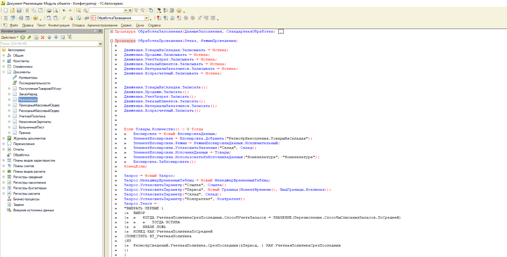
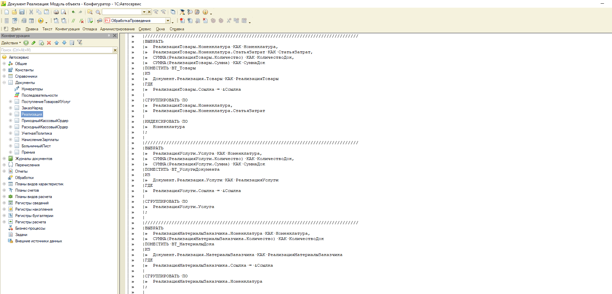
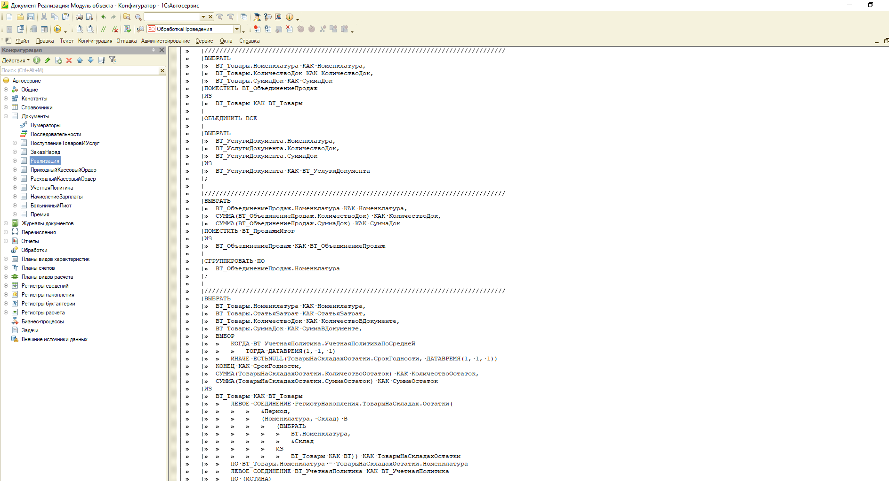
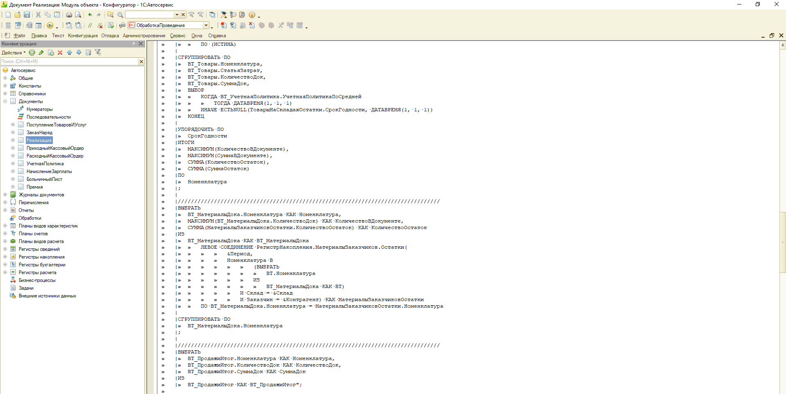
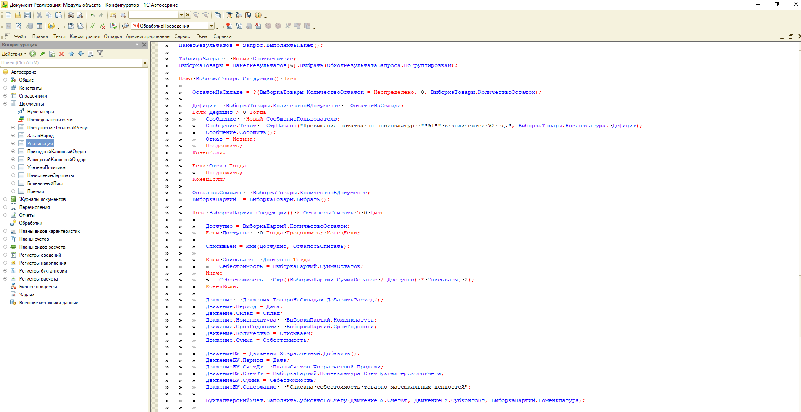
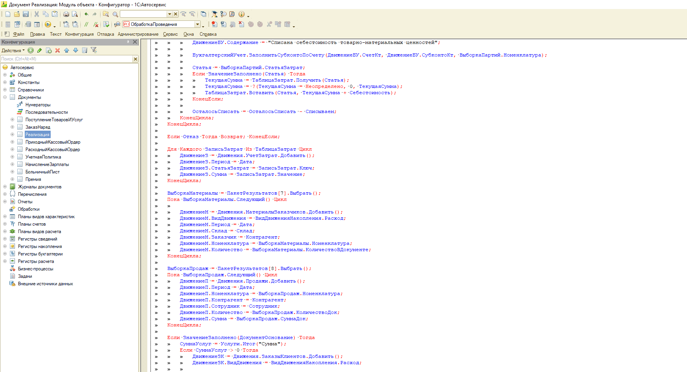
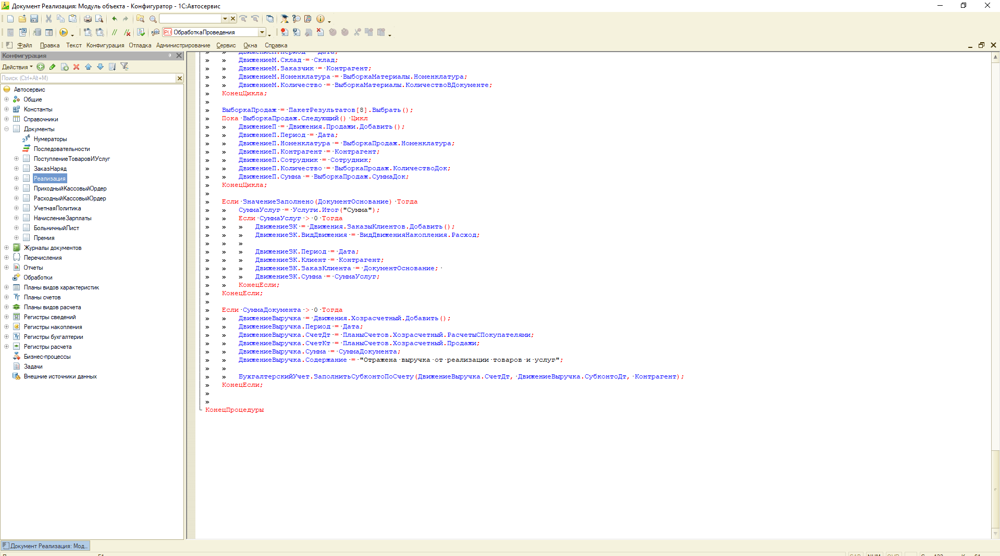

# 🛠️ Комплексная автоматизация автосервиса (Центральная ERP + Мобильное приложение клиента)

## 📌 Описание проекта и архитектура
Проектирование и разработка распределенной информационной системы на платформе «1С:Предприятие 8.3», выполненная в соответствии с техническим заданием. Система автоматизирует ключевые бизнес-процессы предприятия и состоит из двух взаимосвязанных конфигураций:
1. **Центральная база (десктопная ERP)** — автоматизирует контуры оперативного, регламентированного (бухгалтерского) и кадрового учета (расчет зарплаты).
2. **Мобильное приложение (клиентский интерфейс)** — автономное приложение на Мобильной платформе 1С для онлайн-записи на обслуживание.

Обмен данными между базами реализован в режиме реального времени через кастомные HTTP-сервисы с сериализацией пакетов в формате JSON.

---

## 🚀 Ключевой реализованный функционал системы
### 1. Оперативный учет и клиент-серверная оптимизация (Центральная база)
* **Архитектура метаданных:** Спроектированы с нуля подсистемы «Продажи», «Покупки» и «ДенежныеСредства».
* **Объекты учета:** Создана сквозная цепочка документов («ПоступлениеТоваровИУслуг», ключевой документ «ЗаказНаряд», «Реализация», кассовые ордера «ПКО» / «РКО») и 6 регистров накопления («ТоварыНаСкладах», «ЗаказыКлиентов», «Продажи», «УчетЗатрат», «ДенежныеСредства», «МатериалыЗаказчиков»).
* **Печатные формы:** Реализован механизм формирования и вывода на печать кастомной печатной формы для ключевого документа «ЗаказНаряд».
* **Оптимизация вызовов (Трафик):** Модули управляемых форм спроектированы с учетом минимизации контекстных вызовов. Логика получения аналитических данных из базы (например, получение статей затрат из номенклатуры при изменении строк в ТЧ документа) реализована через неконтекстные серверные вызовы `&НаСервереБезКонтекста`.
* **Бизнес-эффект:** Обеспечен непрерывный контроль остатков запасов, высокая скорость работы интерфейса и быстрое оформление документов для клиентов. Исключены ошибки «ухода в минус» при одновременном списании материалов несколькими мастерами за счет контроля остатков в транзакции.

#### Технический пруф: Пошаговый алгоритм проведения документа «Реализация»
Для исключения коллизий СУБД и точного расчета партий весь ключевой алгоритм проведения вынесен в оптимальный пакетный запрос с транзакционным контролем дефицита. 

Шаг 1. Инициализация движений и управляемая блокировка (Открыть код)

* **Что реализовано:** Подготовка движений, взведение флагов записи, очистка старых движений. Установка исключительной управляемой блокировки на регистр `ТоварыНаСкладах` по разрезам `Склад` + `Номенклатура`. Начало пакета запросов: динамическое определение метода списания из учетной политики через `ВЫБОР`.
* Скриншот:

Шаг 2. Подготовка и оптимизация исходных данных ТЧ (Открыть код)

* **Что реализовано:** Извлечение данных из табличных частей документа (`Товары`, `Услуги`, `МатериалыЗаказчика`) во временные таблицы (ВТ) с обязательной группировкой `СГРУППИРОВАТЬ ПО` для исключения дублирования строк. Для `ВТ_Товары` настроено индексирование по полю `Номенклатура` для ускорения последующих соединений.
* Скриншот:

Шаг 3. Объединение продаж и получение остатков с учетом политики (Открыть код)

* **Что реализовано:** Объединение товаров и услуг в `ВТ_ПродажиИтог` для оптимизации записи оборотов. Левое соединение `ВТ_Товары` с виртуальной таблицей остатков регистра `ТоварыНаСкладах`. В параметры таблицы остатков передан жесткий отбор по номенклатуре и складу. Конструкция `ВЫБОР` динамически управляет разрезом учета (сворачивает или разделяет по срокам годности) на лету прямо в запросе.
* Скриншот:

Шаг 4. Расчет многомерных итогов и выполнение пакета на СУБД (Открыть код)

* **Что реализовано:** Упорядочивание остатков по `СрокГодности` для обеспечения жесткого порядка FIFO. Расчет многомерных итогов (`ИТОГИ ПО Номенклатура`) для разделения логики «сколько надо всего» и «из каких партий берем». Контроль остатков забалансового учета материалов заказчика. Отправка пакета на сервер СУБД за один серверный вызов `ВыполнитьПакет()`.
* Скриншот:

Шаг 5. Двухуровневый обход, контроль дефицита и себестоимость (Открыть код)

* **Что реализовано:** Двухуровневый обход выборки (Номенклатура -> Сроки годности). Расчет дефицита: при нехватке взводится `Отказ = Истина`, формируется информативное сообщение пользователю (без прерывания цикла, чтобы собрать все ошибки по документу). Алгоритм точного расчета себестоимости списания с защитой от «копеечных хвостов». Формирование движений складского учета и проводок списания себестоимости в Кт счета номенклатуры.
* Скриншот:

Шаг 6. Аккумулирование затрат, забалансовый учет и закрытие заказов (Открыть код)

* **Что реализовано:** Предварительное сворачивание сумм себестоимости в соответствие `ТаблицаЗатрат` в оперативной памяти для оптимизации записи в регистр `УчетЗатрат`. Точка раннего выхода из процедуры при наличии дефицита товаров для экономии ресурсов сервера. Линейное списание забалансовых ТМЦ, запись сгруппированных оборотов продаж и закрытие обязательств по заказам клиентов.
* Скриншот:

Шаг 7. Фиксация выручки в регламентированном учете (Открыть код)

* **Что реализовано:** Проверка на нулевую сумму документа. Формирование финальной бухгалтерской проводки по отражению выручки (Дт РасчетыСПокупателями — Кт Продажи) на полную сумму документа. Автоматическое заполнение аналитики (`Субконто`) для контрагента через универсальную процедуру. Завершение процедуры — физическая запись всех наборов движений платформой при успешном закрытии транзакции.
* Скриншот:

### 2. Регламентированный и кадровый учет (Центральная база)
* **Бухгалтерский контур:** Настроен план счетов `Хозрасчетный` (с субконто) и автоматическое формирование проводок при проведении документов через регистр бухгалтерии для оперативного анализа финансового результата.
* **Расчет заработной платы и мотивация:** Разработан план видов расчета `Начисления`, регистры расчета и документы учета (`НачислениеЗарплаты`, `БольничныйЛист`, `Premium` / `Премия`) с использованием механизмов вытеснения по графикам времени. Реализован алгоритм расчета премий сотрудникам в размере 10%, а также учет разовых поощрений.
* **Бизнес-эффект:** Автоматизирован расчет сдельной и повременной оплаты труда мастеров с учетом их графиков работы, больничных и премиальных выплат, а также формирование классической оборотной-сальдовой ведомости.

### 3. Мобильное приложение и кастомный интерфейс (Мобильная база)
* **Архитектура метаданных:** Созданы локальные справочники (`Услуги`, `Сотрудники`, `Пользователи`), документ `ЗаписьКлиента` и специализированная обработка-мастер `ЗаписьКлиентовНаУслугу`.
* **Безопасность и интерфейс:** Настроены роли `НеавторизованныйПользователь` / `АвторизованныйПользователь` и кастомные экранные формы регистрации и авторизации.
* **Бизнес-эффект:** Клиенты получили удобный, безопасный и визуально понятный пошаговый инструмент для онлайн-записи на обслуживание прямо со своих смартфонов (кэширование данных на устройстве обеспечивает высокую скорость работы).

### 4. HTTP-интеграция и REST API (Взаимодействие баз)
* **Центральный узел:** На стороне ERP развернут HTTP-сервис `users` с шаблонами URL и методами для авторизации (`getUser`), регистрации (`register`) и передачи заказов (`customerOrders`).
* **Мобильный клиент:** Логика отправки и парсинга JSON-пакетов вынесена в общие модули `АутентификацияИАвторизация` и `ОбменСОсновнойБазой`.
* **Бизнес-эффект:** Заявки на ремонт, оформленные на смартфонах, мгновенно регистрируются в центральной базе, исключая ручной ввод и дублирование данных.

### 5. Аналитическая отчетность (СКД)
* **Реализация:** На базе Системы компоновки данных созданы 7 комплексных отчетов (`ТоварыНаСкладах`, `Продажи`, `ФинансовыйРезультат`, `ДвижениеНаличныхДенег`, `МатериалыЗаказчика`, `НачисленияЗаработнойПлаты`, `ОборотноСальдоваяВедомостьПоСчету`).
* **Бизнес-эффект:** Руководство получило инструмент оперативного мониторинга рентабельности боксов, маржинальности продаж и эффективности работы сотрудников с гибкими динамическими отборами.

---

## 📂 Инструкция по развёртыванию и системные требования

### Системные требования:
* Платформа «1С:Предприятие 8.3» (версия не ниже 8.3.22) с поддержкой мобильной разработки.
* Наличие веб-сервера (Apache 2.4 или IIS) для публикации HTTP-сервисов центральной базы.

### Шаги для запуска проекта:
1. Создайте новую пустую информационную базу в стартере «1С:Предприятие».
2. Запустите её в режиме **Конфигуратора**.
3. В главном меню выберите пункт: *Конфигурация ➡️ Открыть конфигурацию*.
4. После открытия выберите пункт: *Конфигурация ➡️ Загрузить конфигурацию из файлов...* 
5. Укажите путь к папке с исходным кодом из данного репозитория и дождитесь окончания загрузки.
6. Обновите конфигурацию базы данных (клавиша **F7**).

---

## 🔮 План дальнейшей доработки проекта
1. **Развитие графической бизнес-аналитики**: Разработка специализированного «Монитора руководителя» с графиками доходов, расходов и маржинальности бизнеса на базе механизмов диаграмм СКД .
2. **Интерактивное планирование занятости**: Масштабирование подсистемы графиков работы сотрудников для вывода интерактивной сетки занятости мастеров в интерфейс мобильного приложения.
3. **Автоматизация подсистемы уведомлений**: Внедрение подсистемы рассылки сервисных сообщений клиентам о статусе готовности автомобиля из ремонта.

